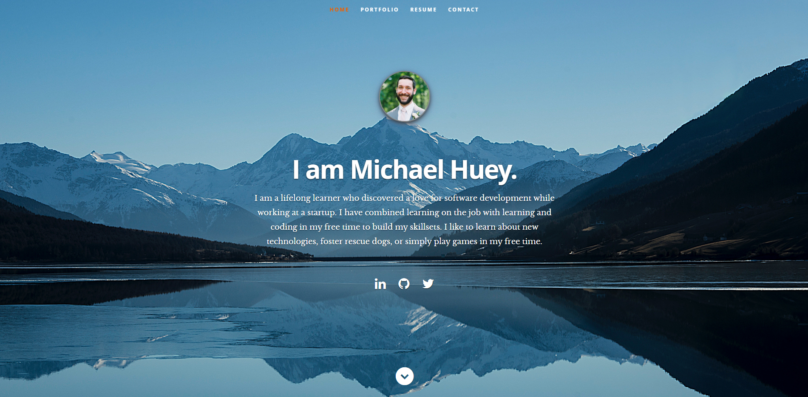

# React.js Portfolio Website

This is the source code for my personal portfolio website and resume. 

# Inspiration
My React Knowledge base and inspiration were from this 10 hour video by John Smilga from CodingAddict partnering with freeCodeCamp.org. The video can be found [here](https://www.youtube.com/watch?v=4UZrsTqkcW4&t=1622s).

The current design of the site itself is based on me cobbling together resources from multiple ReactJS tutorials. Unbeknownst to me, a majority of those tutorials were getting their design basics from this Udemy Course: [Projects in ReactJS: The Complete React Learning Course by Eduonix](https://www.udemy.com/projects-in-reactjs-the-complete-react-learning-course/learn/v4/overview). The various searches and tutorials that I ended up reading were all based on work done by a student from that course, which I discovered while googling a problem I encountered. 

## HTML Design Template
[Ceevee Template by Styleshout](https://www.styleshout.com/free-templates/ceevee/)

## CSS Frameworks
[Normalize.css](https://github.com/necolas/normalize.css/)

[HTML5 Doctor Reset](html5doctor.com/html-5-reset-stylesheet/)

[Skeleton CSS Framework](http://www.getskeleton.com/)
